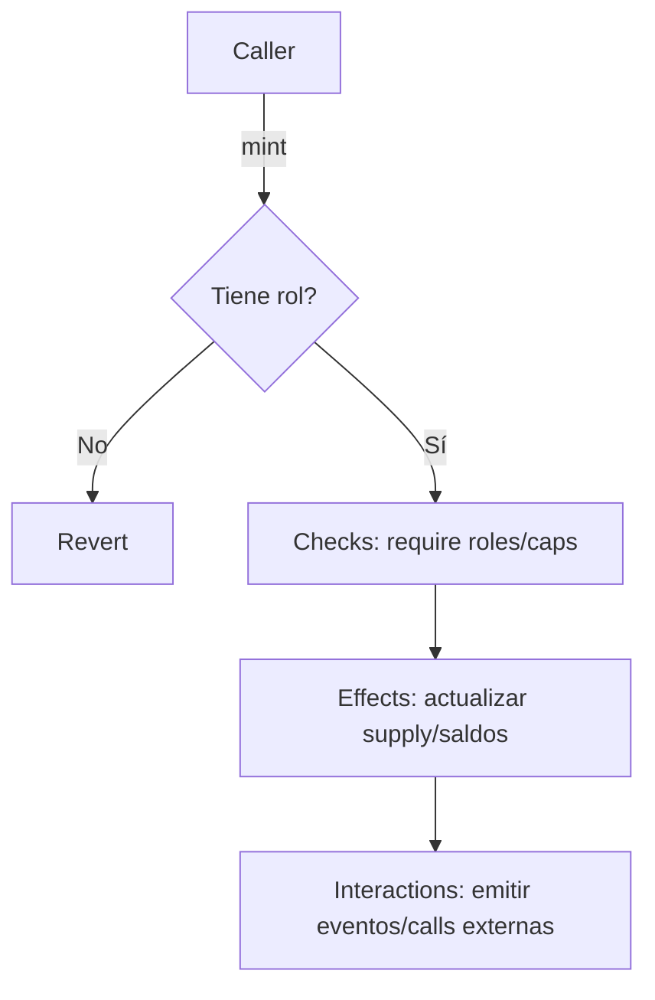

# Blockchain

Repositorio práctico para aprender blockchain 0→1→2 en español neutro. Incluye ejemplos en EVM (Hardhat/Foundry), frontend con Next.js + ethers.js, scripts en Python, y muestras iniciales en Solana (Rust) y Move (Aptos/Sui). Optimizado para clonar, instalar y ver una demo en <15 minutos.

---

## Índice

- Ruta de aprendizaje (4 semanas)
- Cómo empezar (3 comandos por stack)
- Currículum por módulos (criptografía, consenso, EVM, testing, frontend, oráculos/TheGraph, DeFi/tokens, DAOs, bridges, ZK, legal)
- Ejemplos prácticos (ERC20, dApp, Python KPIs, IPFS, reentrancy)
- Seguridad (patrones, auditoría básica, checklist pre-deploy)
- Build in public (issues, kanban, first issues)

---

## Ruta de aprendizaje (4 semanas)

> Objetivos medibles orientados a resultados; dedica ~7–10 h/semana.

- Semana 1: Fundamentos + EVM/solidity
  - Objetivos: entender hashes, firmas, Merkle; EVM memoria/gas; compilar y testear un ERC20 básico.
  - Métricas: 10 tests unitarios pasando; cobertura >80% en `evm/hardhat`.
- Semana 2: Frontend dApp + testnets
  - Objetivos: conectar wallet, leer `totalSupply`, hacer `mint` con rol.
  - Métricas: dApp construye sin errores; contrato verificado en Sepolia.
- Semana 3: Oráculos/TheGraph + KPIs
  - Objetivos: consumir precios (mock), crear subgraph básico, generar CSV de transfers con Python.
  - Métricas: subgraph corriendo local/testnet; `data/transfers.csv` generado.
- Semana 4: Seguridad + DeFi/DAO + cross-chain
  - Objetivos: mitigar reentrancy, usar `ReentrancyGuard`, `Ownable`/`Pausable`; revisar checklist.
  - Métricas: prueba de reentrancy pasa (ataque simulado bloqueado); checklist firmado.

---

## Cómo empezar

Tres comandos por stack (asumiendo Node 18+, pnpm o npm, y Python 3.10+):

- Hardhat (EVM)
  1) `cd evm/hardhat`
  2) `npm install`
  3) `npm test`

- Next.js dApp
  1) `cd dapp-next`
  2) `npm install`
  3) `npm run dev`

- Python (scripts)
  1) `cd python`
  2) `python -m venv .venv && . .venv/bin/activate` (Windows: `.venv\Scripts\activate`)
  3) `pip install -r requirements.txt`

Variables: copia `.env.example` a `.env` según cada carpeta. No uses llaves reales en este repo.

---

## Proyectos y retos

| Proyecto | Dificultad | Entregables |
|---|---|---|
| ERC20 con roles + tests + deploy | 🟢 | contrato + tests + script deploy + verificación |
| dApp: leer `totalSupply` y `mint` | 🟢 | UI básica + estado de tx + manejo de errores |
| KPIs Python: `transfers.csv` | 🟢 | script + CSV + README |
| IPFS demo: subir imagen y usar como `tokenURI` | 🟡 | script/node + CID + NFT `mint` |
| Reentrancy: prueba atacante y fix | 🟡 | contrato `Vault` + test CEI + `ReentrancyGuard` |
| Subgraph básico | 🟡 | subgraph local + consultas |
| Solana hello world | 🟡 | programa Rust + client TS |
| Move hello world | 🟡 | paquete Move + tests |
| Bridge modelado y riesgos | 🔴 | documento + diagrama + threat model |

---

## Seguridad: antes de hacer deploy

- Patrones: `Ownable`, `Pausable`, `ReentrancyGuard`, `AccessControl`.
- Auditoría básica: Slither, Mythril. Revisa `security/slither.md`.
- Checklist: `security/checklist.md`.
- No claves reales: usa `.env.example`, provee RPC públicos o infura/alchemy dev.

Diagrama (mermaid) de flujo de `mint` seguro (CEI):

---

## Build in public

- Issues: abre issues descriptivos con pasos de reproducción y contexto.
- Kanban: usa Projects en GitHub (Backlog → In progress → Done).
- Good first issue: etiquetamos tareas pequeñas y de alto impacto.
- PRs: agrega descripción, motivación, y pruebas. Sigue `CONTRIBUTING.md`.

---

## Estructura

Consulta el árbol en este README y los `README.md` de cada subcarpeta para instrucciones específicas.

---

## Variables de entorno

- Ver `.env.example` en la raíz y en cada subproyecto (`dapp-next/.env.example`, etc.)
- Ejemplos: `RPC_URL`, `PRIVATE_KEY` (usa una llave temporal sólo en testnet), direcciones de contratos.

---

## Licencia

MIT — ver `LICENSE`.

