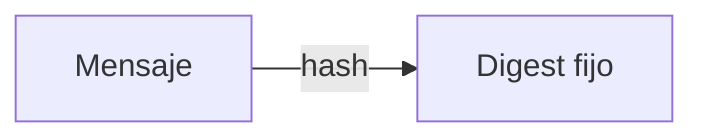
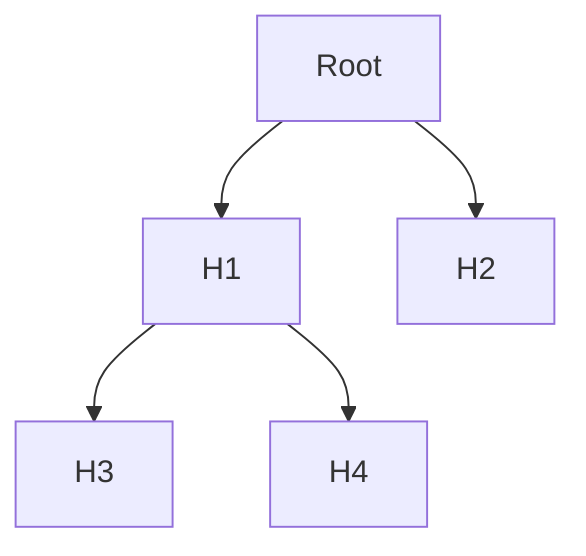
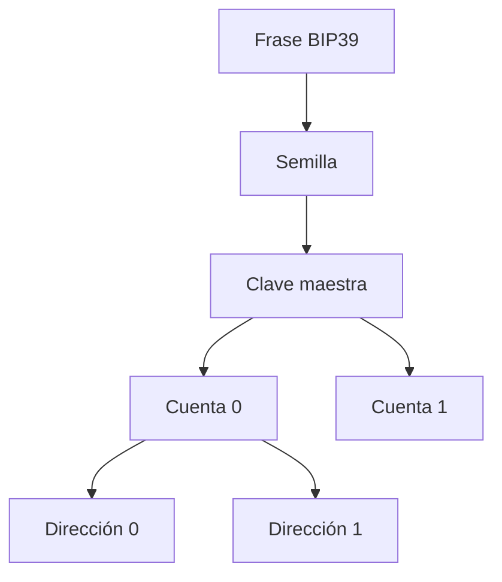
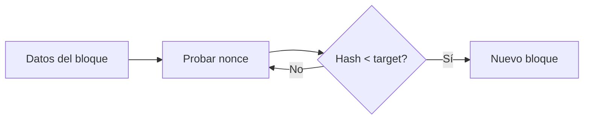
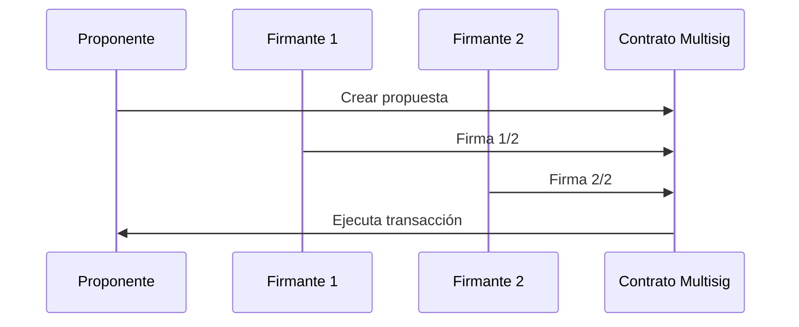

#+ Fundamentos de criptografía

Objetivo: entender los bloques básicos que permiten a blockchain funcionar sin confianza centralizada.

## Hashes
- Propiedades: determinista, resistente a colisiones, preimagen, segunda preimagen.
- Usos: integridad de datos, direcciones, PoW.



### ¿Qué es y por qué importa?
Un hash es como una “huella digital” de un archivo o mensaje. Si el archivo cambia en un bit, la huella cambia completamente. En blockchain, esto permite encadenar bloques y verificar integridad.

### Analogía rápida
Piensa en una máquina que tritura documentos: sin la máquina no puedes reconstruir el documento original (preimagen difícil), pero puedes comparar dos bolsas de confeti para ver si venían del mismo documento (igualdad de hash).

### Ejemplos reales y noticias
- Bitcoin usa SHA-256 para minado y direcciones. Ethereum usa Keccak-256 para muchas operaciones (p. ej., calcular `keccak256("MINTER_ROLE")`).
- SHA-1 mostró colisiones prácticas (proyecto SHAttered, 2017), impulsando la migración a SHA-2/SHA-3.

### Ejercicios
- Calcula el hash de “hola” y “Hola” y compara. ¿Por qué difieren tanto?

## Firmas digitales
- Claves pública/privada (ECDSA/Ed25519).
- Verificación sin compartir la clave privada.

### ¿Qué es y por qué importa?
Permite demostrar que “yo” (poseedor de la clave) autoricé una transacción sin revelar mi clave. La red verifica firmas sin confiar en nadie.

### Caso de uso
- En Ethereum, cada transacción está firmada por el propietario de la dirección. También se usan firmas off-chain (EIP-712) para autorizar acciones sin gastar gas (p. ej. `permit` en tokens).

## Árboles de Merkle
- Raíz compacta de muchos datos; pruebas de inclusión O(log n).



### ¿Por qué importa?
Permite demostrar que un elemento está dentro de un conjunto grande con una prueba pequeña (pocos hashes). Se usa en clientes livianos y airdrops.

### Ejemplo real
- Airdrops: se publica una raíz de Merkle; cada usuario presenta su prueba para reclamar.

## UTXO vs Cuenta
- UTXO: cada salida es indivisible; transacciones consumen UTXOs y crean nuevos.
- Cuenta: balances mutables por dirección (Ethereum). Más simple para smart contracts.

### ¿Cuándo usar cuál?
- UTXO (Bitcoin): más sencillo para auditorías de “monedas” y privacidad por coin selection.
- Cuenta (Ethereum): ideal para contratos que actualizan estados internos frecuentemente.

## Errores comunes
- Creer que “cifrar” es igual a “hashear”: el hash no es reversible; el cifrado sí (con clave).
- Reutilizar claves privadas en múltiples redes sin separar ambientes.

## Preguntas guía
- ¿Qué pasa si el hash cambia en 1 bit? ¿Por qué?
- ¿Cómo pruebo que un elemento está en un Merkle tree?

---

## Guía para principiantes

Esta sección resume los conceptos en lenguaje sencillo, con analogías y ejercicios prácticos.

### Glosario rápido
- Hash: huella digital de datos; cambia por completo ante pequeñas modificaciones.
- Firma digital: prueba matemática de autoría con tu clave privada, verificable con la clave pública.
- Clave privada/pública: secreto que firmas vs dato público para verificar; de la pública derivan direcciones.
- Árbol de Merkle: resumen compacto de muchos datos con pruebas pequeñas de inclusión.
- UTXO: modelo tipo “billetes”; cada salida es un valor indivisible que se consume/crea.
- Cuentas: modelo tipo “saldo bancario” por dirección; facilita smart contracts.

### Hashes: paso a paso
1) Qué es: función que transforma datos de cualquier tamaño en un valor fijo.
2) Propiedades: determinista, difícil de invertir, efecto avalancha, colisiones muy improbables.
3) Para qué sirve: encadenar bloques, verificar integridad, generar identificadores.
4) Buen tip: nunca “guardes” contraseñas, guarda su hash con sal (off-chain).

### Firmas digitales: paso a paso
1) Dos claves: privada (firmar) y pública (verificar). La privada nunca se comparte.
2) Flujo: preparar datos → hashear → firmar con privada → verificar con pública.
3) Uso en blockchain: toda transacción válida está firmada por su emisor.
4) Buenas prácticas: usa wallets seguras; guarda tu seed offline; separa llaves por entorno.

### Árboles de Merkle: paso a paso
1) Hashea cada elemento (hojas) y combina en pares hasta una raíz (Merkle root).
2) Para probar que “X” pertenece, envías solo los hashes del “camino” necesario.
3) Beneficio: pruebas pequeñas incluso con millones de elementos.

### UTXO vs Cuentas: paso a paso
- UTXO (billetes): gastas salidas y creas nuevas (incluye “cambio”). Ideal para pagos y auditorías claras.
- Cuentas (saldo): aumentas/disminuyes balances y actualizas estado de contratos. Ideal para DeFi/NFTs.

### Analogías rápidas
- Hash = huella digital o confeti de una trituradora (no reconstruible).
- Firma digital = firmar un cheque, pero matemático y verificable por todos.
- Árbol de Merkle = índice/resumen del libro para probar que una página es del libro correcto.
- UTXO = cartera con billetes; Cuentas = banco con saldo.

### Ejercicios prácticos
1) Hash en tu equipo (PowerShell Windows):
   - `Set-Content demo.txt "hola"` y luego `Get-FileHash .\demo.txt -Algorithm SHA256`.
   - Cambia el contenido a “Hola” y repite. ¿Qué observas?
2) Explica a un amigo por qué compartir tu clave pública no pone en riesgo tu clave privada.
3) Dibuja un árbol de Merkle con 4 elementos y marca qué hashes necesitas para probar la inclusión del elemento 3.
4) Da un ejemplo donde el modelo UTXO sea mejor (pista: muchas entradas/salidas) y otro donde el de cuentas sea mejor (pista: lógicas de contratos complejas).

### Mini‑quiz
- ¿Por qué un hash no se “deshashea” como un cifrado?
- ¿Qué verifica exactamente una firma digital en una transacción?
- ¿Por qué las pruebas de Merkle son pequeñas incluso con muchos elementos?
- Explica UTXO usando la analogía de billetes.

---

## Conceptos adicionales importantes

### Cifrado simétrico vs asimétrico
- Simétrico: misma clave para cifrar/descifrar (p. ej., AES). Rápido; ideal para guardar datos privados off-chain.
- Asimétrico: par de claves (pública/privada) para cifrar/firmar (p. ej., RSA, ECC). En blockchain usamos ECC (secp256k1/Ed25519).

### HMAC (códigos de autenticación de mensajes)
- Hash con clave secreta para verificar integridad + autenticidad de mensajes fuera de la cadena.
- Útil en APIs/backends: garantiza que el mensaje no fue alterado y proviene del emisor esperado.

### Aleatoriedad, entropía y nonces/IV
- Entropía: “cantidad de azar” de una fuente. Claves débiles vienen de mala entropía.
- Nonce/IV: valores únicos por operación de cifrado o transacción para evitar repeticiones/replays.
- En blockchain, los nonces de cuenta evitan que un atacante reenvíe (replay) una transacción antigua.

### Semillas (mnemonics) y wallets HD
- BIP39: frase mnemónica (12/24 palabras) → semilla binaria.
- BIP32/BIP44: derivación jerárquica de múltiples claves/direcciones desde una sola semilla.



Buenas prácticas: guarda la mnemónica offline; considera passphrase adicional (BIP39) y hardware wallets.

### Direcciones y checksums (EIP‑55)
- En Ethereum, las direcciones usan checksum por mayúsculas/minúsculas (EIP‑55) para detectar errores de tipeo.

### Compromisos (commitment schemes)
- Comprometer hoy, revelar mañana: publicar `commit = hash(secreto || sal)` y después revelar `secreto` y `sal` para verificar. Evita trampas en subastas/juegos on-chain.

### Prueba de trabajo como rompecabezas de hash
- Objetivo: encontrar un nonce tal que `hash(bloque || nonce) < target`.


### Multi‑firma y firmas umbral
- Multi‑sig M‑de‑N: se requieren M firmas válidas de N posibles para ejecutar.
- Firmas umbral (p. ej., BLS): una sola firma agregada representa a varias partes.



### VRF (aleatoriedad verificable)
- Un oráculo (p. ej., Chainlink VRF) produce un número aleatorio con prueba criptográfica que cualquiera puede verificar en cadena.
- Evita manipulación de “randomness” por mineros/validadores o por el propio contrato.

### Tries y estado en Ethereum
- Además de árboles de Merkle “simples”, Ethereum usa Merkle‑Patricia Tries para representar el estado (cuentas, storage, código) con pruebas eficientes.
- Permite a clientes ligeros verificar partes del estado sin descargarlo todo.

### Gestión práctica de claves
- Separación de ambientes: dev/testnet/mainnet con claves distintas.
- Hardware wallets para mainnet; limitar permisos (roles) y usar timelocks/pausas.
- Copias de seguridad: mnemónica + passphrase; para alta seguridad, dividir la semilla (Shamir) bajo procedimientos seguros.

### Diagrama: firma y verificación
```mermaid
flowchart LR
  U[Usuario con clave privada] -->|firma(hash)| TX[Transacción firmada]
  TX --> N[Red]
  PK[Clave pública] --> N
  N -->|verifica firma| OK{Válida?}
  OK -- Sí --> A[Aceptar]
  OK -- No --> R[Rechazar]
```

### Ejercicios extra
1) Diseña un flujo commit‑reveal para un juego de “piedra, papel o tijera” y explica cómo evita trampas.
2) ¿Por qué un VRF es preferible a `block.timestamp` o `blockhash` para aleatoriedad on‑chain?
3) ¿Qué ventajas prácticas ofrece una wallet HD frente a generar claves sueltas?
4) Propón reglas de un multisig 2‑de‑3 para una tesorería y discute sus trade‑offs.
