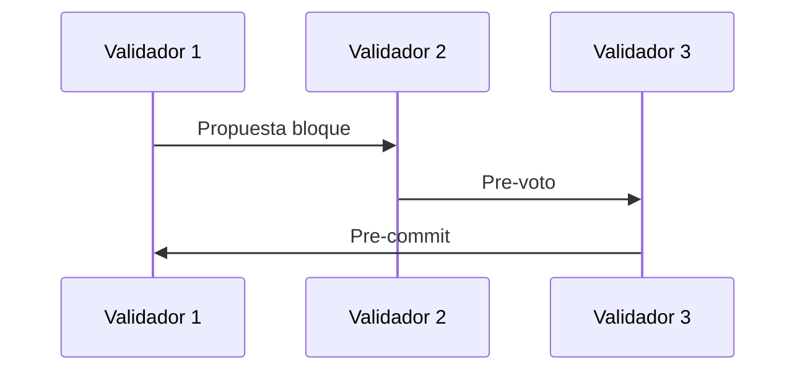

#+ Consenso

Panorama: PoW, PoS, BFT, finality; pros/cons y preguntas guía.

## Proof of Work (PoW)
- Seguridad por costo computacional; energía como recurso escaso.
- Pros: robusto y simple. Contras: alto consumo energético, latencia.

### Ejemplos y noticias
- Bitcoin mantiene PoW y ha resistido ataques coordinados por años; debates de energía → iniciativas de minería con excedentes renovables.
- Ataques 51% en cadenas pequeñas (Ej.: Ethereum Classic sufrió varios en 2020), muestran riesgo si el hashrate es bajo.

## Proof of Stake (PoS)
- Seguridad por colateral en tokens; penalidades (slashing).
- Pros: eficiencia, finality rápida. Contras: plutocracia, complejidad.

### Ejemplos y noticias
- Ethereum “The Merge” (2022) migró de PoW a PoS, reduciendo consumo energético drásticamente.
- Debates sobre centralización de validadores (ej. pools/líderes) y riesgos de censura.

## BFT (Byzantine Fault Tolerant)
- Protocolos tipo Tendermint/HotStuff con rondas y votos.

### Casos de uso
- Cosmos SDK/Tendermint: finality rápida útil para pagos y DeFi interchain.
- Aptos/Sui (variantes HotStuff): latencias bajas, alto throughput.

## Finality
- Probabilística (PoW) vs económica/óptima (PoS+BFT).

Preguntas guía
- ¿Qué ataque previene el slashing? ¿Cómo?
- ¿Por qué la finality reduce forks?

## Errores comunes
- Confundir “finality” con “confirmaciones”: en PoW es probabilística; en muchos PoS/BFT es económica o determinística.
- Subestimar la latencia de red: afecta tiempos de propuesta y propagación.

