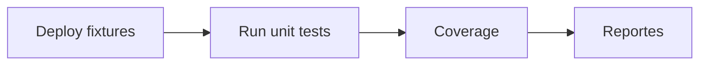

#+ Hardhat y testing

Stack: TypeScript, mocha/chai, ethers, fixtures; coverage y gas reporter.

- Instala: `npm install` en `evm/hardhat`.
- Tests: `npm test` (incluye casos "should fail").
- Coverage: `npm run coverage`.
- Fixtures: reutiliza despliegues para acelerar pruebas.



## ¿Qué probar?
- Casos felices y de fallo (reverts), eventos emitidos, cambios de estado, permisos y roles.
- Pruebas de propiedad: invarianzas (si usas Foundry/echidna más adelante).

## Ejemplo (fragmento chai/ethers)
```ts
await expect(token.connect(user).mint(user.address, 1)).to.be.reverted; // sin rol
await token.grantRole(ethers.id('MINTER_ROLE'), user.address);
await expect(token.connect(user).mint(user.address, 100n)).to.emit(token, 'Transfer');
```

