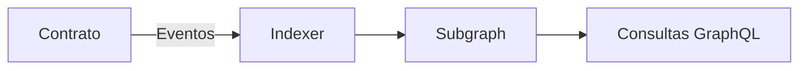

#+ Oráculos y TheGraph

## Oráculos (Chainlink)
- Evitan depender de datos off-chain no verificables directamente.
- Usa contratos verificados y redes de test.

### Ejemplo simple (precio)
Un contrato lee un feed de precios (ETH/USD) de Chainlink en testnet para cotizar ventas. Importante: manejar stale data (respuesta vieja) y límites.

### Noticias
- Chainlink CCIP (Cross-Chain Interoperability Protocol) apunta a mensajes/transferencias seguras entre cadenas.

## TheGraph
- Indexa eventos on-chain con subgraphs.
- Flujo: definir schema → mapping → deploy.



### Ejemplo de consulta GraphQL
```graphql
{
  transfers(first: 5, orderBy: timestamp, orderDirection: desc) {
    id
    from
    to
    value
  }
}
```

